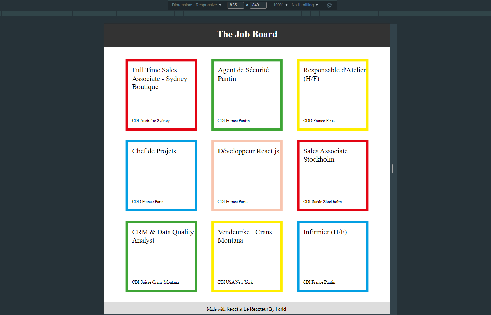

# The Job Board

## **Création d'une application [React](https://fr.reactjs.org/) - Projet Front-End **

 Exercice réalisé dans le cadre du [Bootcamp "Le Reacteur"](https://www.lereacteur.io/) 

**Objectifs** :

- Initialiser un projet [React](https://fr.reactjs.org/) (via npx create-react-app my-app)
- Créez un projet [React](https://fr.reactjs.org/) (via create-react-app)
- Nettoyer le projet initial (src/App.css, src/index.css,src/logo.svg, src/App.js, src/App.test.js, src/setupTest.js, src/reportWebVitals.js)
- Créer un composant
- Transmettre des props (Job ayant pour props className, title, contractType, country et city)
- Appliquer un style (via className)
- Savoir utiliser le [React Developer Tools](https://chrome.google.com/webstore/detail/react-developer-tools/fmkadmapgofadopljbjfkapdkoienihi)
- Respecter la maquette initiale fournie via l'outil [Figma](https://www.figma.com/fr/).
- Respecter l'arbre de composants à créer (App, Header, Title, Jobs, Job )
- Testez à nouveau votre formulaire en local en utilisant [netlify](https://www.netlify.com/)
- Push son projet React sur [Github](https://github.com/)

**Vous pouvez retrouver l'application déployée en ligne via ce lien [netlify](https://thejobboard.netlify.app/)**

**Vous pouvez retrouver la [maquette proposée](https://www.figma.com/file/pQZsazjdxEOHC4l6d8BBRw?node-id=0:1)**

